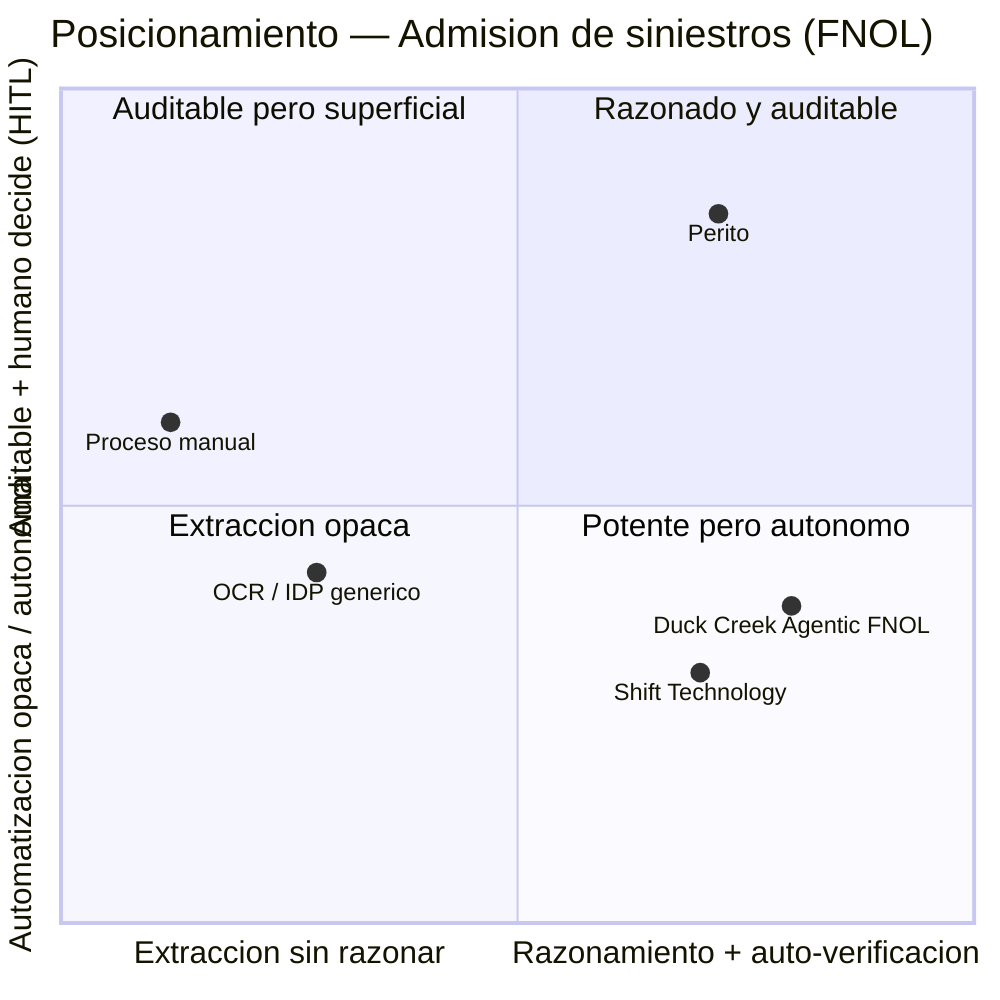
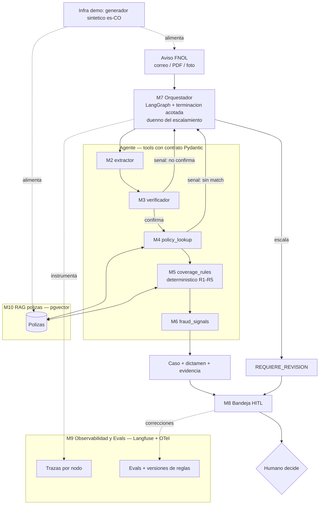
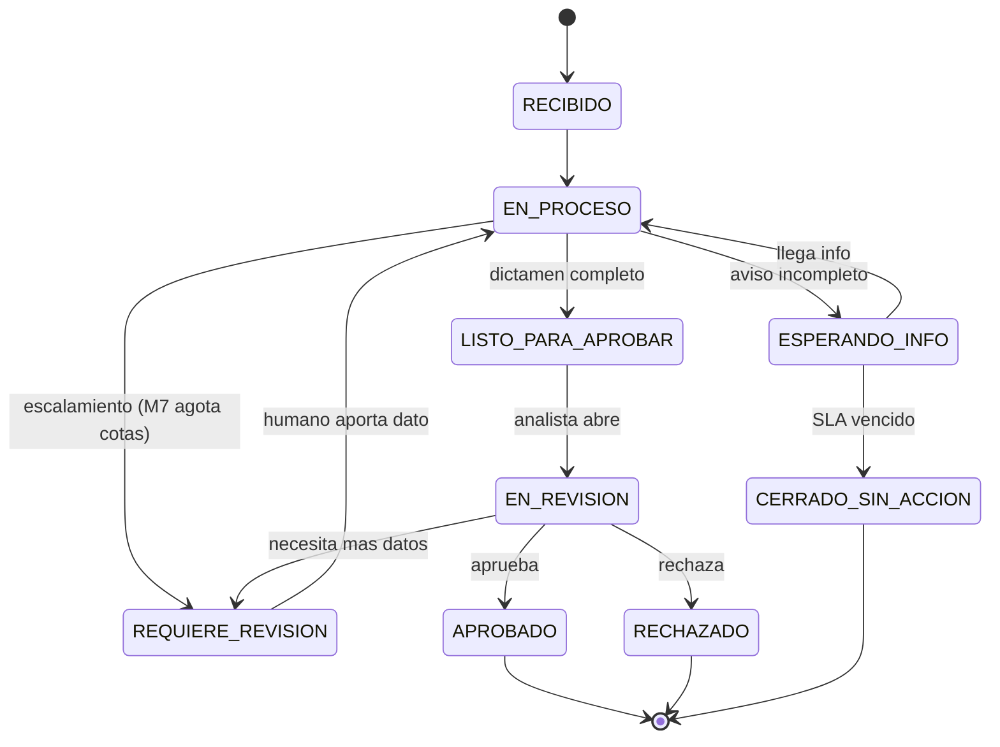

# PRD — Perito

| | |
|---|---|
| **Producto** | Perito — copiloto agéntico de admisión y triage de siniestros (FNOL) |
| **Versión** | v1 (Estación 2, Hardcore AI C3) |
| **Fecha** | Julio 2026 |
| **Encuadre** | **Proyecto de portafolio honesto** — el objetivo es demostrar ingeniería de sistemas agénticos, no ganar mercado |
| **Inputs** | `docs/pvb.md`, `docs/overview.md`, `docs/mercado.md`, `docs/icp.md`, `docs/critica.md`, `docs/stack.md`, `research/validacion.md`, `research/critica.md` |
| **Estado** | Completo (13 segmentos). Vacíos declarados en el Apéndice B. |

> **Nota de honestidad transversal:** este PRD se apoya solo en evidencia verificada. Las cifras refutadas en verificación adversarial (tiempos de FNOL, adopción LATAM, tamaños de mercado absolutos) **no se usan**. Lo que no se pudo validar se declara en el Apéndice B, no se inventa.

---

## Tabla de contenidos
1. One-Liner + JTBD
2. Contexto y Problema
3. ICP Detallado
4. UVP y Diferenciadores
5. Casos de Uso + Modelo de siniestros/cobertura
6. Principios de Diseño No Negociables
7. User Journeys
8. MVP Scope (MoSCoW)
9. Especificación Funcional: Módulos
10. Métricas de Éxito
11. Plan de Evaluación del Agente
12. Riesgos y Mitigaciones
13. Plan de Entrega (5 días + después)
- Apéndice A: Resolución del Paso 0 (conflictos)
- Apéndice B: Supuestos, vacíos y limitaciones declaradas
- Apéndice C: Estados del caso y glosario

---

## 1. One-Liner del Producto + JTBD

**Tagline:** *"Perito: prepara el dictamen del siniestro; tú lo firmas."*

**Frase de producto:** Perito es un copiloto agéntico de admisión de siniestros: lee un aviso caótico (correo, PDF, fotos), extrae los datos, verifica la cobertura contra la póliza y señala inconsistencias, entregando un caso estructurado y **explicado con evidencia citada** para que un analista humano lo apruebe. Es un *perito asistente*: prepara el dictamen y deja rastro auditable, pero **la decisión siempre la firma la persona**.

**JTBD (tres capas):**
- **Funcional —** *Cuando* llega un aviso de siniestro desordenado, *quiero* que un agente extraiga los datos, verifique la cobertura y señale lo sospechoso con su razonamiento a la vista, *para* resolver la admisión mucho más rápido y con rastro auditable, en vez de transcribir y revisar todo a mano.
- **Emocional —** *Quiero* que me quite la transcripción mecánica **sin quitarme el juicio ni el control**, para sentir que decido mejor, no que me reemplazan.
- **Social —** *Quiero* mostrarle a cumplimiento y al regulador **cómo y por qué** se admitió cada siniestro, para quedar respaldado ante una auditoría.

*Actor principal: analista de admisión/triage.*

**Misión:** Hacer visible y confiable el trabajo invisible de admitir un siniestro: que la parte mecánica la haga un agente auditable y la parte de juicio la conserve el humano. Perito no reemplaza al analista ni al ajustador; les quita la transcripción y les da evidencia razonada para decidir mejor y más rápido. Como pieza de ingeniería, demuestra un sistema agéntico con verificación adversarial, decisiones determinísticas donde importan, trazabilidad y human-in-the-loop.

---

## 2. Contexto y Problema

**Dolores del mercado (verificados):**
- Intake mayormente manual: **STP en P&C < 10%**; ~60% de aseguradoras sin ningún STP.
- **Automatizar es fácil; ESCALAR es lo difícil:** solo **7% de aseguradoras escala IA con éxito** (BCG 2025) aunque 67% la prueba → el cuello de botella es integración/confianza/adopción, no el modelo.
- Documentos caóticos (correos coloquiales, PDFs, fotos de calidad variable, campos faltantes, referencias de póliza inconsistentes).
- Verificación de cobertura propensa a error; fraude sin capacidad de revisar todo.

**¿Por qué ahora?**
1. **Construible por una persona:** orquestación agéntica madura + modelos multimodales + LLM por capas hacen viable armarlo solo.
2. **Tecnología probada en producción** (Shift, 2.6B+ pólizas) y mercado creciendo a **~28% CAGR**; el core ya lo incorpora (Duck Creek Agentic FNOL, abr-2026).
3. **Durable, no de moda:** que solo el 7% escale IA —con modelos que ya extraen bien— prueba que el cuello de botella es workflow/confianza/integración, no output. Mejores modelos foundation no lo resuelven.

**Alternativas actuales y por qué son insuficientes:** proceso manual (no escala) · OCR/IDP genérico (extrae, no razona ni valida) · módulo del core (potente pero exige core moderno y es genérico) · reglas/RPA (frágiles ante lo no estructurado).

**El constraint que se vuelve feature:** la Circular SIC 002/2024 (Habeas Data/Ley 1581) exige un estudio de impacto de privacidad documentado antes de diseñar cualquier IA que trate datos personales. Perito lo cumple por diseño (PIA + trazas + HITL).

---

## 3. ICP Detallado

> ICP = hipótesis de diseño, no segmentación validada. Sin entrevistas → sin verbatims. **[H]** = hipótesis a validar (ver Apéndice B).

**Firmographics [H]:** aseguradoras P&C medianas (ramos masivos: autos/SOAT, hogar), **sin core moderno**, Colombia/LATAM (es-CO).
> ⚠️ Tensión reconocida: el segmento "sin core moderno" es también el **más difícil de integrar** (puentes RPA/data-lake). Para el portafolio no bloquea; para una venta real sería el reto #1.

**Personas:**
| Persona | Rol | Le importa |
|---|---|---|
| Líder de Siniestros / COO | Comprador económico | Tiempo de ciclo, costo, capacidad sin crecer headcount |
| Analista de admisión/triage | **Usuario final** (sale en la demo) | Que le quiten lo mecánico sin quitarle el control |
| Cumplimiento / Legal | Veto de confianza | Habeas Data, PIA, trazabilidad, responsabilidad, sesgo |
| Ajustador (río abajo) | Afectado, no comprador | Casos limpios; no sentirse reemplazado (riesgo de sabotaje) |

**Anti-persona [H]:** grandes aseguradoras con core moderno (ya usan FNOL nativo) · micro/informales (sin volumen) · Vida/Salud (dominio distinto, mayor exposición legal).

**Pains:** intake manual y lento · documentos caóticos · cobertura propensa a error · fraude sin capacidad de revisar · riesgo regulatorio.

**Triggers [H]:** volumen que satura · **auditoría bajo Circular SIC** · transformación digital · competidor más rápido.

**Objeciones → respuestas:** "el core ya lo trae" → especialización es-CO/compliance · "¿y si dictamina mal?" → HITL + reglas · "¿nos quita responsabilidad?" → **no, es indelegable** · "datos personales" → PIA · "mis ajustadores se resisten" → copiloto, no reemplazo.

**Verbatims:** ninguno (sin entrevistas). Supuestos falsificables + plan de validación en Apéndice B.

---

## 4. UVP y Diferenciadores

**UVP:** Perito es una capa de admisión de siniestros que razona y se auto-verifica con evidencia citada, mantiene la decisión en el humano (HITL) y está localizada para el contexto colombiano — sin exigir un core moderno.

**Diferenciación:** vs. OCR/IDP (razona y valida, no solo extrae) · vs. core Duck Creek (no exige core moderno; prioriza auditabilidad+HITL+localización) · vs. Shift (fraude explicable orientado a decisión humana) · vs. RPA (LLM para lo caótico + reglas para lo correcto) · vs. manual (conserva juicio, quita transcripción).

**Matriz de posicionamiento:**

*Tercer diferenciador (fuera del 2×2): localización es-CO (español caótico, SOAT, Circular SIC) — real para una venta, superficial como ingeniería.*

> ⚠️ El aire de Perito está sobre todo en el eje Y (auditable+HITL). En el eje X, Duck Creek está cerca. Honestidad: la diferenciación descansa en auditabilidad + localización, no en superioridad de razonamiento. **No se investigaron competidores locales LATAM** — el cuadrante superior-derecho podría no estar vacío.

---

## 5. Casos de Uso + Modelo de siniestros/cobertura

> ⚠️ **Modelo ilustrativo y simplificado** — no replica productos reales. Da ground truth a la demo/evals.

**Tipos de siniestro:** (1) Auto-Colisión · (2) Auto-Hurto total (exclusiones) · (3) Hogar-Daño por agua (súbito vs. gradual) · (4) **SOAT** (sin deducible, sin culpa, tope legal) — *SOAT es Should-have; MVP core = tipos 1-3.*

**Motor de reglas (determinístico, en orden, cada regla cita cláusula):**
R1 Vigencia · R2 Cobertura contratada · R3 Exclusiones · R4 Límite (suma asegurada) · R5 Deducible. Salidas: `CUBIERTO`/`CUBIERTO_PARCIAL`/`NO_CUBIERTO`/`REQUIERE_REVISION`. Override SOAT: sin R5, tope en R4. **La decisión la toma el motor, no el LLM.**

**Casos de uso:**
| UC | Actor | Trigger | Resultado | KPI |
|---|---|---|---|---|
| **UC1** Happy path | Analista | Colisión con doc completo | Caso admitido sin transcripción | Touchless-ready rate |
| **UC2** ⭐ Terminación acotada + escalamiento | Analista | Campo faltante/ambiguo, **póliza no encontrada**, o verificador no confirma | Falla segura, no alucina, no se cuelga | % dentro de cotas (0 loops) + accuracy extracción |
| **UC3** Cobertura negativa + cita | Analista | Hurto con causa excluida | `NO_CUBIERTO` auditable con cláusula | Coverage-match + % con cláusula |
| **UC4** ⭐ Fraude razonado | Analista | Inconsistencias (fecha/metadato) | Alerta explicable, evaluada vs. etiqueta | Precisión/recall + % con evidencia |
| **UC5** Observabilidad | Cumplimiento/Ops | Auditar admisiones | Operación auditable y medible | Cobertura trazabilidad + costo/caso |

---

## 6. Principios de Diseño No Negociables

| P | Principio | Prohibido | Origen |
|---|---|---|---|
| **P1** | El humano decide, siempre (HITL) | Que Perito niegue/apruebe/cierre solo | Responsabilidad indelegable, litigios |
| **P2** | Determinismo donde la corrección es obligatoria (cobertura por reglas) | Que el LLM opine si algo está cubierto | Riesgo legal por cobertura errada |
| **P3** | Todo dictamen trazable y citado | Una conclusión sin fuente | Auditabilidad, PIA/Circular SIC |
| **P4** | No alucinar: escalar en vez de inventar + terminación acotada | Inventar un valor; loops sin límite | Loops medidos (LangGraph); músculo del proyecto |
| **P5** | Habeas Data por diseño (minimización + PIA) | Enviar PII innecesaria al LLM | Circular SIC 002/2024, Ley 1581 |
| **P6** | Explicabilidad sobre opacidad (fraude razonado) | Flag de fraude sin explicación | Litigio por sesgo (State Farm) |
| **P7** | Honestidad de alcance (proyecto de portafolio) | "Te quitamos el riesgo legal"; cifras refutadas; demo como producción | Encuadre del proyecto |

---

## 7. User Journeys

**J1 — Happy path (Analista Diana):** (1a) abre caso limpio → ve caso estructurado con evidencia enlazada + dictamen `CUBIERTO` con deducible calculado → **aprueba en ~40s**. (1b) caso con un campo mal → pulsa *Corregir*, ajusta, aprueba; **la corrección queda registrada como dato de eval.**

**J2 — Operador (Cumplimiento Andrés):** ve métricas del día → configura umbrales (fraude, presupuesto de tokens) → **actualiza una regla → Perito la versiona y la corre contra el set de evals; solo se activa si no rompe accuracy** → revisa tablero de evals → ante auditoría, abre la traza completa y **exporta evidencia para el PIA.**

**J3 — Edge: interrupción.** (A) Diana cierra sesión a mitad → estado persistido, retoma sin perder nada. (B) aviso entrante incompleto sin seguimiento → `ESPERANDO_INFO` con SLA de envejecimiento; Perito **no adivina** el dato para cerrar solo.

**J4 — Edge: el agente escala (terminación acotada).** Póliza extraída no existe → verificador no encuentra match → reintenta **dentro de cotas duras** → al agotarlas **se detiene (no loop)** → `REQUIERE_REVISION` mostrando qué lo bloqueó + candidatas cercanas → el humano cierra el hueco. *(El escalamiento de fraude es una variante.)*

---

## 8. MVP Scope (MoSCoW)

**✅ Must (espinazo agéntico demostrable):**
1. Generador de datos sintéticos es-CO (infra) · 2. Ingesta multimodal (texto/PDF/foto) · 3. Extracción estructurada con contrato · 4. Verificación adversarial · 5. Grounding + manejo de "no encontrada" · 6. Motor de reglas R1-R5 + cita de cláusula · 7. **Terminación acotada** · 8. HITL (aprobar/corregir/rechazar + persistencia) · 9. **Fraude razonado (mínimo)** · 10. **Observabilidad con herramienta real (Langfuse/OTel): traza por nodo + costo + replay** · 11. Evals (extracción + coverage-match) · 12. **Tool contracts tipados + validación** · 13. Eval runs versionados.

**🟡 Should:** fraude vs. etiqueta Kaggle · redacción de acuse · tablero de evals visual · **SOAT** · cola de SLA.
**🔵 Could:** versionado de reglas con test-gate · multi-usuario · más tipos de documento.
**⛔ Won't:** enrutamiento al ajustador · audio · integración real con core · agregación multi-documento · dedup robusto · **aprendizaje/recalibración** (los 3 muros no resueltos) · **auth real** (MVP = selector de rol stub).

> **Floor de observabilidad:** si integrar Langfuse tarda, el mínimo es trace JSON estructurado + panel simple; la herramienta real es el target. **Núcleo irrenunciable:** Must #2-#8 + #10.

---

## 9. Especificación Funcional: Módulos

**Roles:** Analista (bandeja, aprobar/corregir/rechazar) · Operador/Cumplimiento (panel, config, export) · Admin/Dev (todo). *Ajustador fuera del MVP.* **Control de acceso = selector de rol stub; auth real = Won't.**

**Módulos de producto:**
- **M1 Ingesta** — recibe/normaliza aviso, crea caso, marca duplicados.
- **M2 Extracción** (`extractor`) — Claude multimodal → campos con contrato Pydantic, cada campo enlazado a su origen.
- **M3 Verificación adversarial** — confirma extracción contra la fuente; emite señal si no puede.
- **M4 Grounding** (`policy_lookup`) — match contra base de pólizas; candidatas cercanas si no hay match.
- **M5 Cobertura** (`coverage_rules`, determinístico) — R1-R5 + cita de cláusula + override SOAT; gestión de reglas con versionado+test-gate (Could).
- **M6 Fraude** (`fraud_signals`) — razona inconsistencias, alerta explicable, no bloquea.
- **M7 Orquestador** (LangGraph + terminación acotada) — dirige el flujo; **dueño de la política de escalamiento/terminación**; impone límites de rondas/tokens + detección de ciclos.
- **M8 HITL** — estados, aprobar/corregir/rechazar, persistencia, registro de correcciones, acuse (Should).
- **M9 Observabilidad & Evals** (Langfuse + OTel) — traza por nodo (latencia/tokens/modelo/IO), replay, costo/caso, tablero de evals, export para PIA.
- **M10 RAG pólizas** (pgvector) — indexa pólizas, recupera cláusula para M4/M5.

**Infra de demo/test (no es producto):** generador de datos sintéticos es-CO + dataset de ground truth.

---

## 10. Métricas de Éxito

**North Star:**
- **Núcleo automedible (eval):** % de casos con dictamen **correcto (vs. ground truth) + cláusula citada**.
- **Completa (demo en vivo):** lo anterior **+ aprobado por el humano sin corrección**.

**KPIs:**
| Cat. | KPI | Meta |
|---|---|---|
| Activación | Procesamiento end-to-end sin fallo | ≥95% |
| Activación | Touchless-ready rate (baseline STP <10%) | Mejora direccional |
| Calidad | Accuracy de extracción vs. ground truth | ≥90-95% |
| Calidad | Correctitud del motor de cobertura (unit test) | 100% por construcción |
| Calidad | Exactitud end-to-end de cobertura (con propagación de error) | ≈ accuracy de extracción |
| Calidad | % dictámenes con cláusula citada | 100% |
| Calidad | Precisión/recall de fraude vs. etiqueta | Reportar honesto ⚠️ (válido solo si el doc encoda la señal) |
| Calidad | Campos inventados | ≈0 |
| Eficiencia | Costo (tokens)/caso + % dentro de presupuesto | Medir + ≥95% |
| Eficiencia | Latencia end-to-end/caso | Medir |

**Utilidad (medible, sin tiempo):** correcciones por caso · acciones para aprobar.

**Seguridad — invariantes *enforced* (aserción fail-closed):** 100% cobertura por reglas (P2) · 100% fraude con evidencia (P6) · 100% decisiones con aprobación humana (P1) · 100% terminación dentro de cotas (P4) · 100% trazabilidad (P3) · PII minimizada (P5).

> Retención: no medible en portafolio; proxy = baja tasa de corrección. Declarado, no inflado.

---

## 11. Plan de Evaluación del Agente

**Dataset:** backbone Kaggle (campos + etiqueta de fraude) + capa sintética es-CO + pólizas sintéticas con cláusulas + ground truth por caso. **Estratos (~20-40 c/u):** happy · campos faltantes · póliza no encontrada · cobertura negativa · fraude · SOAT · documento "sucio".
> ⚠️ **Requisito del generador:** en filas etiquetadas fraude, **inyectar la inconsistencia detectable** en el documento; si no, el eval de fraude mide ruido.

**Criterios:** factualidad (accuracy extracción, grounding, 0 inventados, cobertura correcta) · adherencia (invariantes P1-P4/P6) · relevancia (razones de fraude reales, cita aplicable).

**QA de outputs:** harness automático (pytest + DeepEval) por estrato · inspección de trazas (replay Langfuse) · spot-check humano · regresión con test-gate · LLM-as-judge para explicaciones (Should).

**Red-teaming (cada ataque defiende un invariante):** ⭐ **inyección de prompt en el documento** (P1) · ⭐ **sesgo** variando nombre/ubicación (State Farm) · presión de alucinación (P4) · evasión de fraude (P6) · ataque de loop (P4) · fuga de PII (P5) · ruido puro (P4).
> Mínimo demostrable: los dos titulares (inyección + sesgo), aunque sean 2-3 casos c/u.

---

## 12. Riesgos y Mitigaciones

*Impacto = como producto. Residual = lo que te afecta en el portafolio.*
| # | Riesgo | Prob. | Imp. | Resid. | Mitigación |
|---|---|---|---|---|---|
| 1 | **Idoneidad del dataset Kaggle** | Media | — | **Alto** | **Día 0: verificar esquema**; Plan B CUAD/pólizas sintéticas |
| 2 | **Scope creep + tool sprawl** | Alta | — | **Alto** | MoSCoW estricto; floor de observabilidad; demo grabada |
| 3 | **Loops + costo tokens** (LangGraph 33.8%) | Media | Alto | **Alto** | Terminación acotada propia + presupuesto + fail-closed (P4) |
| 4 | Alucinación de extracción | Alta | Medio | Medio | Verificador (M3), escalar (P4), medir |
| 5 | Validez del eval sintético (incl. fraude) | Media | Medio | Medio | Variar dificultad, inyectar señales, **declarar** |
| 6 | Inyección de prompt | Media | Alto | Bajo | Red-team, no auto-decisión (P1) |
| 7 | Cobertura mal dictaminada (indelegable) | Media | Alto | Bajo | HITL (P1), determinismo (P2), citas (P3) |
| 8 | Sesgo en fraude (State Farm) | Media | Alto | Bajo | Explicabilidad (P6), red-team de sesgo |
| 9 | PII / Habeas Data | Media | Alto | Bajo | PIA, minimización, trazas (P5) |
| 10 | Comoditización (Duck Creek) | Alta | Alto | **Bajo** | Es portafolio; wedge local; se declara |

**Tus 3 riesgos reales (por residual):** #1 dataset, #2 scope/tools, #3 loops — todos de ejecución. *También contemplados: costo API/rate-limits, sabotaje del ajustador, inmadurez LATAM, ICP no validado.*

---

## 13. Plan de Entrega (5 días × 10h + después)

**Regla:** cada día cierra con algo demostrable.
- **Día 0 (2h):** verificar que el dataset Kaggle tiene los campos para las reglas. Gate: Plan B si no.
- **Día 1 — Fundaciones:** FastAPI + Postgres/pgvector · esquemas + tool contracts · generador sintético es-CO (con inyección de fraude). *Demostrable: fila Kaggle → aviso colombiano + póliza + verdad.*
- **Día 2 — Extracción + verificación:** `extractor` + verificador + `policy_lookup`. *Demostrable: aviso caótico → JSON verificado o escala.*
- **Día 3 — Cobertura + fraude:** reglas R1-R5 + cita (RAG) + fraude razonado mínimo. *Demostrable: `NO_CUBIERTO` con cláusula + alerta explicada (momento trust).*
- **Día 4 — Orquestación + observabilidad + HITL:** LangGraph + terminación acotada · Langfuse (o floor) · bandeja HITL. *Demostrable: sistema completo con trazas en vivo (corazón de la demo).*
- **Día 5 — Evals + demo:** harness (pytest+DeepEval) por estrato · red-team mínimo (inyección + sesgo) · pulir + **grabar demo de respaldo**. *Demostrable: métricas + demo.*

**Orden de corte:** SOAT → fraude-vs-Kaggle → tablero visual → acuse → Langfuse real (cae al floor). **Núcleo irrenunciable:** Días 2-4.

**Después (30/60/90):** +30 Should-haves + entrevistas para validar ICP · +60 Could-haves + red-team completo · +90 integración con core real (aquí dejaría de ser portafolio).

---

## Apéndice A — Resolución del Paso 0 (conflictos)

| # | Conflicto | Resolución |
|---|---|---|
| 1 | Durable vs. comoditizado | La extracción se comoditiza; la orquestación+compliance+HITL es lo durable |
| 2 | Producto vs. portafolio | **Portafolio honesto** (encuadre de todo el PRD) |
| 3 | ICP sin entrevistas | Hipótesis [H] + supuestos falsificables; no se inventan verbatims |
| 4 | Qué cifras usar | Solo CAGR (~28%); absolutos como "estimado de vendor"; refutadas fuera |
| 5 | LATAM riesgo u oportunidad | Hipótesis de wedge no probada |
| 6 | Alcance MVP | Estrecho + interesante: extracción→verificación→cobertura→fraude razonado→HITL; enrutamiento fuera |
| 7 | Trust sin sobreprometer | Reduce error operativo y deja evidencia; **nunca** transfiere responsabilidad |
| 8 | Tipos de siniestro/reglas | Modelo ilustrativo de 4 tipos + R1-R5 (Segmento 5) |

## Apéndice B — Supuestos, vacíos y limitaciones declaradas

**Honestidad consolidada (lo que este PRD NO puede afirmar):**
1. **ICP sin validar** — cero entrevistas, cero verbatims. Supuestos falsificables + plan de validación (entrevistas a analista, cumplimiento, líder de siniestros; datos Fasecolda).
2. **Cifras de FNOL refutadas** — tiempos/costos del triage manual (venían de blogs de vendors). Falta fuente primaria colombiana.
3. **LATAM/Colombia mal documentado** — cifras de adopción refutadas; wedge no probado.
4. **SFC vs. SIC + SOAT** — no se halló la postura de la Superintendencia Financiera (distinta de la SIC) ni cómo interactúa el SOAT con la automatización.
5. **Competidores locales LATAM no investigados** — el cuadrante superior-derecho podría no estar vacío.
6. **Datos sintéticos** — riesgo de métricas infladas; se declara, no se sobre-afirma.
7. **Validez del eval de fraude** — depende de que el generador inyecte las señales.
8. **Portafolio, no producto** — los riesgos legales/mercado son conciencia de dominio, no exposición real; nada se despliega.

## Apéndice C — Estados del caso y glosario

**Glosario:** FNOL = First Notice of Loss (aviso de siniestro) · HITL = human-in-the-loop · STP = straight-through processing · PIA = estudio de impacto de privacidad · SOAT = Seguro Obligatorio de Accidentes de Tránsito · SIC = Superintendencia de Industria y Comercio · SFC = Superintendencia Financiera de Colombia.

---

*Hardcore AI 30X — Cohorte 3 — Perito — Estación 2 — Julio 2026*
