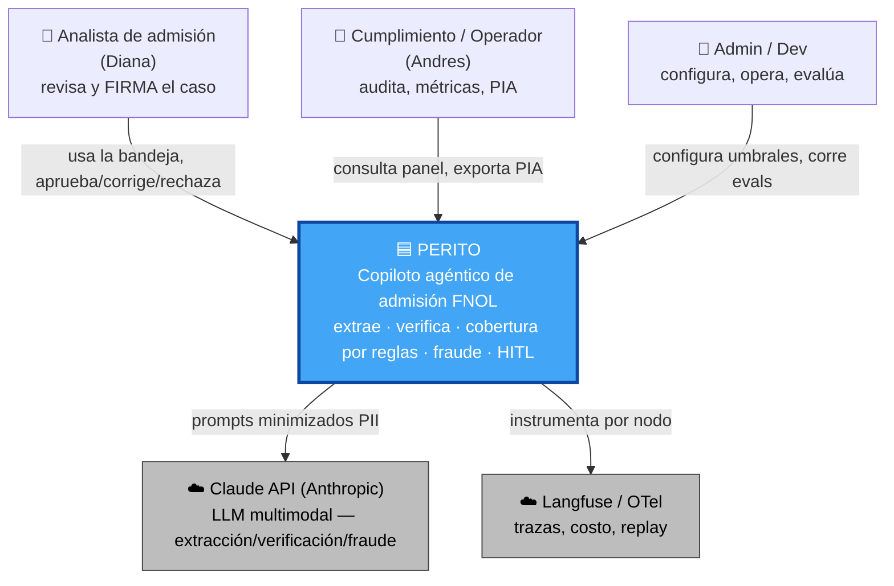
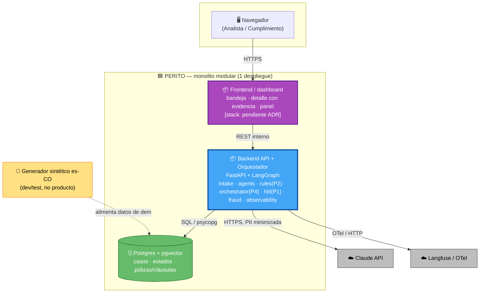

# Arquitectura Just-in-Time (AJIT) — Perito

> Puente Inception → Construction. Reglas: **simplicidad sobre complejidad** · seguridad por diseño · diagramas Mermaid.
> Base: `PRD.md` + artefactos de Inception (Application Design, Units). Idioma es-CO.
> Modo: co-creación segmento por segmento (gate tras cada uno).
> **Estado**: Segmentos 1-2 generados (gate). Pendientes: 3 (NFR), 4 (Riesgos/SPOF), 5 (ADRs).

---

## Segmento 1 — Diagrama de Contexto (C4 Nivel 1)

**Fronteras**: Perito hace la **admisión y triage** de siniestros (extraer → verificar → cobertura determinística → fraude → HITL). **Delega** a externos: el razonamiento multimodal (Claude API) y la observabilidad (Langfuse/OTel). **NO** hace: pagos, enrutamiento al ajustador, integración con core (Won't).

**Texto alternativo**: 3 actores humanos (Analista, Cumplimiento, Admin/Dev) usan Perito. Perito delega en 2 sistemas externos: Claude API (razonamiento LLM, con PII minimizada — P5) y Langfuse/OTel (observabilidad). Perito es el sistema central; todo lo demás es actor o externo.

---

## Segmento 2 — Diagrama de Contenedores (C4 Nivel 2)

> Aquí aterriza formalmente el **Frontend**. Regla de simplicidad aplicada: **monolito modular**, no microservicios (coherente con "construible por una persona" + portafolio).

**Texto alternativo**: el navegador (Analista/Cumplimiento) habla por HTTPS con el Frontend/dashboard; el dashboard consume por REST el Backend API+Orquestador (FastAPI+LangGraph, que contiene todos los módulos backend); el backend usa Postgres+pgvector (SQL), Claude API (HTTPS con PII minimizada) y Langfuse (OTel). El generador sintético alimenta datos de demo a la DB. Todo dentro de un único despliegue (monolito modular).

**Contenedores y justificación**:
| Contenedor | Tecnología | Por qué |
|---|---|---|
| **Frontend / dashboard** | *pendiente ADR* (FastAPI+templates/HTMX vs React+Vite) | Vitrina de P1/auditabilidad; demo-grade. |
| **Backend API + Orquestador** | FastAPI + LangGraph | Espinazo agéntico; dueño de P2/P4/P1 en módulos separados. |
| **Postgres + pgvector** | PostgreSQL 16 + extensión pgvector | Casos+estados relacionales y RAG de pólizas en un solo motor (simplicidad). |
| Claude API | Anthropic (externo) | Razonamiento multimodal; PII minimizada (P5). |
| Langfuse/OTel | Externo (o floor JSON) | Trazabilidad (P3); floor si tarda. |

> ⚠️ **ESTE DIAGRAMA ESTÁ DIBUJADO PARA LA TOPOLOGÍA HTMX** (no es neutral). El borde `Browser → HTTPS → FE → REST interno → API` es el modelo **server-rendered**: el FE llama al API desde el servidor.
>
> **Si ADR-001 elige React+Vite, el borde de datos cambia** y el diagrama debe actualizarse:
> - `Browser → HTTPS → API` **directo** (la SPA corre en el navegador y llama al API desde el browser).
> - Arrastra **CORS** (orígenes permitidos explícitos, nunca `*` en endpoints con acción).
> - Arrastra **autorización estrictamente server-side**: el selector de rol stub (RNF-14) **nunca** se valida en la SPA — siempre en el API (SECURITY-08).
> - El "Frontend" pasa a ser un **contenedor estático aparte** (2 cajas, 2 toolchains).
>
> Con **HTMX**: 1 caja, server-rendered, authz naturalmente server-side, el diagrama ya está correcto tal cual.
> **→ ADR-001 debe decidir esto con la implicación de topología/CORS/authz sobre la mesa, no solo "1 caja vs 2 cajas".**

---

## Segmento 3 — Matriz de Atributos No Funcionales (NFR)

> En Perito los NFR **son** los invariantes no negociables. Los 3 más críticos (headline) + los que los acompañan. Cada uno con su táctica arquitectónica.

| # | Atributo (NFR) | Justificación según PRD | Táctica Arquitectónica (cómo lo logramos) |
|---|---|---|---|
| **1** | **Terminación acotada (P4)** | LangGraph loopea 33.8%; loops = costo + cuelgue (riesgo #3) | Caps duros en el **orquestador** (max rondas + presupuesto tokens + detección de ciclos); al agotar → `REQUIERE_REVISION`. Aserción fail-closed "0 loops". |
| **2** | **Determinismo de cobertura (P2)** | Cobertura errada = riesgo legal | Motor `rules/` **puro**, único invocador = orquestador, **cero aristas LLM→motor** (probado en el grafo). PBT-03 sobre el motor. |
| **3** | **HITL fail-closed (P1)** | Responsabilidad indelegable | Estado terminal solo vía `hitl/` con `aprobado_por`; `Caso.estado` **inmutable salvo vía hitl**; el FE no alcanza terminal (solo delega). |
| 4 | **Minimización de PII (P5)** | Habeas Data / Circular SIC | El backend construye prompts con PII mínima antes de llamar a Claude; sin PII en logs; export PIA controlado. |
| 5 | **Trazabilidad (P3)** | Auditabilidad / PIA | Instrumentación por nodo (Langfuse/OTel o floor JSON); dictamen siempre con cláusula; evidencia enlazada. |
| 6 | **Eficiencia (costo/latencia)** | Presupuesto de tokens; medir | Presupuesto de tokens como cap (comparte táctica con NFR-1); costo/caso medido por nodo. |

**Los 3 titulares** (los que definen la tesis y más pueden fallar): **P4 terminación · P2 determinismo · P1 HITL**. Todos con **aserción fail-closed** que rompe ruidosamente si se viola (no solo número de dashboard).

---

## Segmento 4 — Riesgos & Puntos Únicos de Falla (SPOF)

| SPOF / Riesgo | Impacto si falla | Contingencia arquitectónica |
|---|---|---|
| **Claude API** (caída / rate-limit) | Sin extracción/verificación/fraude → el flujo no puede avanzar | Reintentos **dentro de las cotas** (P4, no ilimitados) + backoff; al agotar → **fail-closed** a `REQUIERE_REVISION` (nunca inventar). Presupuesto de tokens como guarda. |
| **Postgres + pgvector** (caída) | Sin casos/estados ni RAG de pólizas | Persistencia = estado sobrevive reinicio (J3). En demo es nodo único (aceptable para portafolio, **declarado**); no se promete HA (sería "demo como producción", anti-P7). |
| **Loops de LangGraph** (riesgo #3) | Costo desbocado + cuelgue | Caps propios **por encima** del framework (NFR-1); detección de ciclos. |
| **Langfuse** (integración tarda / cae) | Sin observabilidad rica | **Floor declarado**: trace JSON estructurado + panel simple (PRD §8). No bloquea el núcleo. |
| **Idoneidad del dataset** (riesgo #1) | Evals miden ruido | **Día 0**: verificar esquema; Plan B (CUAD/pólizas sintéticas). Generador **inyecta** la señal de fraude (H-16). |
| **Inyección de prompt** (en el documento) | Intento de auto-decisión | Arquitectura lo neutraliza: el contenido del aviso **no** puede alcanzar estado terminal (P1); red-team H-18. |

**SPOF reales del portafolio**: Claude API y Postgres. Ambos con contingencia **honesta** (fail-closed acotado + persistencia), sin prometer alta disponibilidad de producción (P7).

---

## Segmento 5 — ADRs *(DECIDIDOS)*

| ADR | Decisión | Archivo |
|---|---|---|
| **ADR-001** | **Frontend = FastAPI + templates/HTMX** (bajo lock-in: dominio en contratos Pydantic, HTMX capa de vista delgada; migración futura a React = wrappers JSON sin tocar dominio) | [`adr-001-frontend-stack.md`](adr-001-frontend-stack.md) |
| **ADR-002** | **Monolito modular** (1 despliegue, cada unidad = módulo lógico) | [`adr-002-monolito-modular.md`](adr-002-monolito-modular.md) |
| **ADR-003** | **Langfuse target + floor JSON fallback** (detrás de interfaz de instrumentación) | [`adr-003-observabilidad.md`](adr-003-observabilidad.md) |

**Impacto de ADR-001 en el C4 (Segmento 2)**: el diagrama de contenedores queda **correcto tal cual** (topología HTMX server-rendered). No requiere cambios.

---

## ✅ AJIT COMPLETO — Transición Inception → Construction lista

Artefactos de arquitectura: **C4 Contexto (§1) · C4 Contenedores (§2) · Matriz NFR (§3) · Riesgos/SPOF (§4) · 3 ADRs (§5)**.
Con esto, la Inception + la arquitectura JIT están completas: **backend Y frontend definidos y trazados**, listos para codificar por unidad en Construction (U1→U5).
