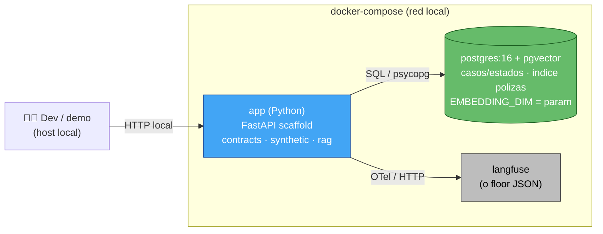

# Deployment Architecture — U1 · Fundaciones & Contratos

> **Deployment de producción: N/A.** Nada se despliega (portafolio, P7). Este documento describe **únicamente la topología del entorno de dev local** (docker-compose), no una arquitectura de despliegue de producción.

## Producción — N/A
No hay diagrama de despliegue cloud (sin API Gateway, Lambda, VPC, balanceadores, multi-AZ). Un diagrama así sería "demo como producción" (anti-P7). El despliegue real es **Won't** (PRD §8); reevaluar solo ante un pivote a producto (PRD §13 "+90").

## Topología de dev local (docker-compose)

**Texto alternativo**: en el host local, docker-compose levanta 3 servicios en una red local: `app` (Python/FastAPI con los módulos de U1), `postgres:16 + pgvector` (casos/estados + índice de pólizas, con la dimensión del vector como parámetro), y `langfuse` (observabilidad, o floor JSON). La app habla con Postgres por SQL y con Langfuse por OTel. Todo en el host — sin nube, sin red de producción.

## Servicios del compose (contrato para Code Gen)
| Servicio | Imagen (indicativa) | Puerto | Volumen | Notas |
|---|---|---|---|---|
| `postgres` | `pgvector/pgvector:pg16` (o postgres+extensión) | 5432 | persistente | extensión pgvector habilitada; dimensión = param |
| `langfuse` | imagen oficial de Langfuse | (su puerto) | — | opcional; floor JSON si tarda (ADR-003) |
| `app` | build local (Python) | (app) | código montado | scaffolding FastAPI; corre generador/tests |

> El `docker-compose.yml` concreto se **construye** en Code Generation (Actividad 5) contra este contrato.
