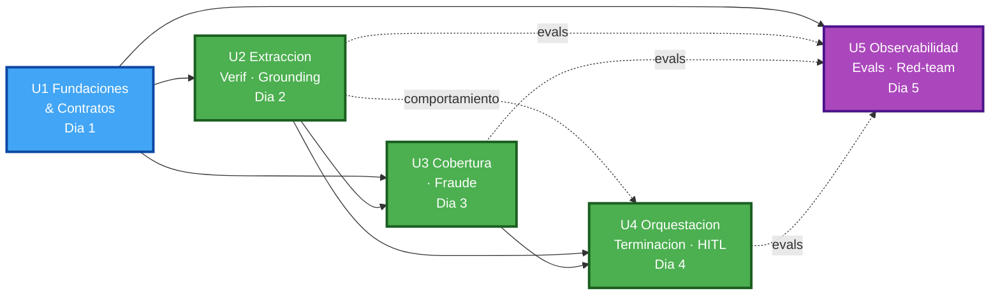

# Dependencias entre Unidades — Perito

> Grafo de dependencias de construcción + secuencia + paralelización. Distingue **dependencia de código** (necesito el artefacto para compilar/usar) de **dependencia de comportamiento** (el fail-closed solo se ejercita cuando existe la otra unidad).

---

## 1. Matriz de dependencias (fila **depende de** → columna)

| desde \ hacia | U1 | U2 | U3 | U4 | U5 |
|---|---|---|---|---|---|
| **U1** Fundaciones | — | | | | |
| **U2** Extracción/Verif/Grounding | ● código | — | | ⚑ comport. | |
| **U3** Cobertura/Fraude | ● código | ● código (H-04→H-07) | — | | |
| **U4** Orquestación/HITL | ● código | ● código | ● código | — | |
| **U5** Observabilidad/Evals | ● código | ○ evals | ○ evals | ○ evals | — |

**Leyenda**: `●` dependencia de código (dura) · `○` dependencia funcional (necesita la unidad viva para evals/instrumentación) · `⚑` **dependencia de comportamiento** (fail-closed de la unidad origen se completa con la destino).

---

## 2. Dependencias de comportamiento (cross-unidad) — nota del usuario capturada

- **U2 → U4 (⚑)**: H-06 (extractor marca campo ausente), H-03 (verifier "no confirma") y H-04 (policy_lookup "sin match") **emiten señales**, pero su comportamiento fail-closed **"escala en vez de rellenar/avanzar"** solo se ejercita cuando el **orquestador (U4)** existe y actúa sobre la señal. → **H-06 no es autocontenida en U2.** El escenario 🔒 de H-06 se prueba end-to-end recién con U4.
- **U2 → U3 (H-04→H-07)**: el resultado de grounding (póliza/candidatas) alimenta el motor de cobertura. Sin U2, U3 no tiene campos válidos que dictaminar.
- **U4 invoca U3**: el orquestador es el único invocador de `coverage_rules` (P2) — dependencia de código dura U4→U3.

> Implicación de test: los escenarios 🔒 de U2 (H-03/H-04/H-06) requieren **stubs del orquestador** para test unitario aislado, y se validan de verdad en la integración U2+U4.

---

## 3. Secuencia de construcción y paralelización

**Alternativa en texto**:
- **U1 primero** (bloquea a todas — contratos + RAG + infra).
- **U2 y U3 pueden empezar tras U1**, pero U3 necesita campos de U2 (H-04→H-07) → en la práctica U2 antes que U3.
- **U4 tras U2+U3** (orquesta ambas; cierra el fail-closed de U2).
- **U5 transversal**: instrumentación puede añadirse en paralelo desde U1; los **evals** requieren U2-U4 vivas.

**Ruta crítica**: U1 → U2 → U3 → U4 (→ U5). **Núcleo irrenunciable**: U2-U4 (calca `execution-plan.md`).
**Paralelización realista (1 persona)**: secuencial por día; instrumentación de U5 goteando desde U1.

---

## 4. Verificación de coherencia
- **P2 preservado entre unidades**: `agents/` (U2/U3-fraude) no importa `rules/` (U3-motor); el único puente es `orchestrator/` (U4). El límite de módulos refuerza "cero aristas LLM→coverage_rules".
- **P1 entre unidades**: solo `hitl/` (U4) muta `Caso.estado`; U2/U3/U5 no escriben estado terminal.
- **Sin ciclos duros**: el grafo de código es un DAG (U1→U2→U3→U4→U5). La `⚑` U2→U4 es de comportamiento/test, no crea ciclo de compilación.
- **Diferidos**: `test_gate_regla` (U5) = firma, no build; estrato SOAT no corre; cola SLA/ESPERANDO_INFO no modelada.
