# Execution Plan — Perito

> Greenfield · Idioma es-CO · Basado en `requirements.md` (M1-M10, Must) + `stories.md` (18 historias) + `personas.md`.
> **Nota de encuadre (esta Inception)**: el recorrido activo llega hasta **Units Generation** + Arquitectura Just-in-Time; luego se cosechan artefactos a `specs/aidlc/`. La fase **Construction** (Code Generation / Build & Test) queda **planificada pero fuera de la ejecución de esta sesión** (se abordará después).

## 1. Resumen de Análisis Detallado

### 1.1 Transformation Scope
- **N/A** — Greenfield (sin código previo, sin reverse-engineering).

### 1.2 Change Impact Assessment
| Área | ¿Aplica? | Descripción |
|---|---|---|
| **User-facing** | Sí | Bandeja HITL (aprobar/corregir/rechazar), panel de cumplimiento. 3 personas activas. |
| **Structural** | Sí | Arquitectura agéntica multi-módulo (M1-M10) + orquestador con terminación acotada. |
| **Data model** | Sí | Contratos Pydantic tipados, esquema de Caso/Póliza/estados, base pgvector. |
| **API** | Sí | FastAPI: endpoints de ingesta, bandeja, decisión, panel/observabilidad. |
| **NFR impact** | Sí | Seguridad (Security Baseline blocking), Habeas Data/PII (P5), terminación (P4), observabilidad (P3), PBT parcial. |

### 1.3 Risk Assessment
- **Risk Level**: **Medium** — complejidad alta pero greenfield (rollback trivial, sin producción).
- **Riesgos de ejecución dominantes (PRD §12)**: #1 idoneidad del dataset, #2 scope creep/tool sprawl, #3 loops/costo tokens. Mitigados por MoSCoW estricto (Q1=B), terminación acotada propia (P4) y verificación Día 0.
- **Rollback Complexity**: Easy (greenfield). **Testing Complexity**: Complex (evals por estrato + PBT + red-team + invariantes fail-closed).

## 2. Workflow Visualization

```mermaid
flowchart TD
    Start(["User Request"])

    subgraph INCEPTION["🔵 INCEPTION PHASE"]
        WD["Workspace Detection<br/><b>COMPLETED</b>"]
        RE["Reverse Engineering<br/><b>SKIPPED</b>"]
        RA["Requirements Analysis<br/><b>COMPLETED</b>"]
        US["User Stories<br/><b>COMPLETED</b>"]
        WP["Workflow Planning<br/><b>COMPLETED</b>"]
        AD["Application Design<br/><b>EXECUTE</b>"]
        UG["Units Generation<br/>(Planning + Generation)<br/><b>EXECUTE</b>"]
    end

    subgraph CONSTRUCTION["🟢 CONSTRUCTION PHASE (planificada, fuera de esta sesión)"]
        FD["Functional Design<br/><b>EXECUTE</b>"]
        NFRA["NFR Requirements<br/><b>EXECUTE</b>"]
        NFRD["NFR Design<br/><b>EXECUTE</b>"]
        ID["Infrastructure Design<br/><b>SKIP</b>"]
        CG["Code Generation<br/>(Planning + Generation)<br/><b>EXECUTE</b>"]
        BT["Build and Test<br/><b>EXECUTE</b>"]
    end

    subgraph OPERATIONS["🟡 OPERATIONS PHASE"]
        OPS["Operations<br/><b>PLACEHOLDER</b>"]
    end

    Start --> WD
    WD --> RE
    RE --> RA
    RA --> US
    US --> WP
    WP --> AD
    AD --> UG
    UG --> FD
    FD --> NFRA
    NFRA --> NFRD
    NFRD --> ID
    ID --> CG
    CG --> BT
    BT --> OPS
    OPS --> End(["Complete"])

    style WD fill:#4CAF50,stroke:#1B5E20,stroke-width:3px,color:#fff
    style RA fill:#4CAF50,stroke:#1B5E20,stroke-width:3px,color:#fff
    style US fill:#4CAF50,stroke:#1B5E20,stroke-width:3px,color:#fff
    style WP fill:#4CAF50,stroke:#1B5E20,stroke-width:3px,color:#fff
    style CG fill:#4CAF50,stroke:#1B5E20,stroke-width:3px,color:#fff
    style BT fill:#4CAF50,stroke:#1B5E20,stroke-width:3px,color:#fff
    style RE fill:#BDBDBD,stroke:#424242,stroke-width:2px,stroke-dasharray: 5 5,color:#000
    style ID fill:#BDBDBD,stroke:#424242,stroke-width:2px,stroke-dasharray: 5 5,color:#000
    style AD fill:#FFA726,stroke:#E65100,stroke-width:3px,stroke-dasharray: 5 5,color:#000
    style UG fill:#FFA726,stroke:#E65100,stroke-width:3px,stroke-dasharray: 5 5,color:#000
    style FD fill:#FFA726,stroke:#E65100,stroke-width:3px,stroke-dasharray: 5 5,color:#000
    style NFRA fill:#FFA726,stroke:#E65100,stroke-width:3px,stroke-dasharray: 5 5,color:#000
    style NFRD fill:#FFA726,stroke:#E65100,stroke-width:3px,stroke-dasharray: 5 5,color:#000
    style OPS fill:#BDBDBD,stroke:#424242,stroke-width:2px,stroke-dasharray: 5 5,color:#000
    style INCEPTION fill:#BBDEFB,stroke:#1565C0,stroke-width:3px,color:#000
    style CONSTRUCTION fill:#C8E6C9,stroke:#2E7D32,stroke-width:3px,color:#000
    style OPERATIONS fill:#FFF59D,stroke:#F57F17,stroke-width:3px,color:#000
    style Start fill:#CE93D8,stroke:#6A1B9A,stroke-width:3px,color:#000
    style End fill:#CE93D8,stroke:#6A1B9A,stroke-width:3px,color:#000

    linkStyle default stroke:#333,stroke-width:2px
```

**Alternativa en texto**:
- INCEPTION: Workspace Detection (COMPLETED) → Reverse Engineering (SKIPPED, greenfield) → Requirements (COMPLETED) → User Stories (COMPLETED) → Workflow Planning (COMPLETED) → Application Design (EXECUTE) → Units Generation (EXECUTE).
- CONSTRUCTION (planificada, fuera de esta sesión): Functional Design (EXECUTE) → NFR Requirements (EXECUTE) → NFR Design (EXECUTE) → Infrastructure Design (SKIP) → Code Generation (EXECUTE) → Build & Test (EXECUTE).
- OPERATIONS: Placeholder.

## 3. Phases to Execute

### 🔵 INCEPTION PHASE
- [x] Workspace Detection (COMPLETED)
- [x] Reverse Engineering (SKIPPED — greenfield)
- [x] Requirements Analysis (COMPLETED)
- [x] User Stories (COMPLETED)
- [x] Workflow Planning (IN PROGRESS → este documento)
- [ ] **Application Design — EXECUTE**
  - **Rationale**: sistema nuevo con múltiples componentes/servicios (M1-M10); hay que definir métodos de componente, reglas de negocio (motor R1-R5, política de terminación) y el diseño de la capa de servicio. Diferenciador = auditabilidad → el diseño debe fijar dónde viven los invariantes P1-P4.
- [ ] **Units Generation — EXECUTE**
  - **Rationale**: nuevos modelos de datos/esquemas, endpoints, lógica compleja, múltiples "paquetes" (extractor, verificador, policy_lookup, coverage_rules, fraud_signals, orchestrator, hitl, observability, rag, infra). Se descompone en unidades de trabajo con grafo de dependencias (aquí se formaliza H-04→H-07, H-16/H-17→resto).

### 🟢 CONSTRUCTION PHASE *(planificada; ejecución en sesión posterior)*
- [ ] **Functional Design — EXECUTE**
  - **Rationale**: lógica de negocio detallada por unidad (motor determinístico, orquestador con caps, fraude). Aquí se ejecuta PBT-01 (identificación de propiedades) por unidad.
- [ ] **NFR Requirements — EXECUTE**
  - **Rationale**: performance, seguridad (Security Baseline), observabilidad, y selección de framework PBT (Hypothesis, PBT-09) + confirmación de stack.
- [ ] **NFR Design — EXECUTE**
  - **Rationale**: incorporar patrones NFR (fail-closed, minimización PII, logging sin PII, terminación acotada, cifrado local) a los componentes lógicos.
- [ ] **Infrastructure Design — SKIP** *(y NO reincorporable como fase)*
  - **Rationale**: **portafolio, nada se despliega** (RES-02, P7); integración real con core y despliegue son **Won't** (PRD §8). Hacer un Infrastructure Design completo (topología cloud/IAM/red/escalado) **contradiría P7 activamente** — es el anti-patrón "demo como producción" que el PRD marca (L157). SKIP no es ahorro de fase: es la opción honesta. No hay mapeo a servicios cloud/IAM/red (coherente con los N/A de SECURITY-02/06/07 en §7.1 de requisitos).
  - **Decisión firme**: NO reincorporar como fase aunque cambien detalles menores; solo se reconsideraría ante un pivote real a despliegue productivo (dejaría de ser portafolio, PRD §13 "+90").
- [ ] **Code Generation — EXECUTE (ALWAYS)**
  - **Rationale**: implementación del espinazo agéntico + tests/PBT/evals.
  - **Entregable de infra local (anotado aquí, en ruta crítica Día 1)**: `docker-compose.yml` con **Postgres/pgvector + Langfuse** (+ scaffolding FastAPI). Es **entorno de dev reproducible**, NO diseño de infra de producción — legítimamente parte de "demostrar ingeniería de sistemas agénticos" (la tesis), sin caer en el anti-patrón P7.
- [ ] **Build and Test — EXECUTE (ALWAYS)**
  - **Rationale**: build + evals por estrato + red-team + aserciones fail-closed de invariantes.

### 🟡 OPERATIONS PHASE
- [ ] Operations — PLACEHOLDER (deploy/monitoring futuros; fuera de portafolio).

## 4. Estimated Timeline (referencia PRD §13 — 5 días × 10h)
- Inception (este recorrido, hasta Units + JIT arch): artefactos de diseño.
- Construction (Días 1-5 del PRD): Día 1 fundaciones · Día 2 extracción+verificación · Día 3 cobertura+fraude · Día 4 orquestación+observabilidad+HITL · Día 5 evals+demo.
- Núcleo irrenunciable de ejecución: Días 2-4.

## 5. Success Criteria
- **Primary Goal**: espinazo agéntico auditable extracción→verificación→grounding→cobertura determinística con cita→fraude razonado→terminación acotada→HITL, con invariantes P1-P7 enforced fail-closed.
- **Key Deliverables**: contratos tipados · motor R1-R5 100% por construcción · orquestador con caps · bandeja HITL con `aprobado_por` · observabilidad por nodo · evals por estrato versionados · generador sintético con fraude inyectado.
- **Quality Gates**: accuracy extracción ≥90-95% · 100% dictámenes con cláusula · 100% decisiones con humano · 0 loops (fail-closed) · campos inventados ≈0 · red-team mínimo (inyección + sesgo).
