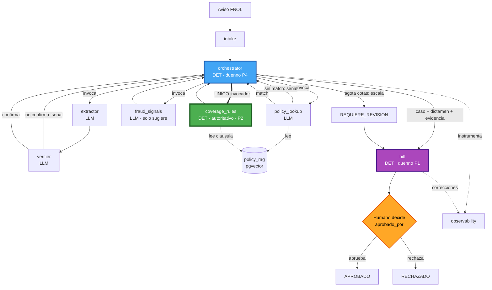

# Dependencias de Componentes — Perito (Application Design)

> Grafo de dependencias + patrones de comunicación + flujo de datos.
> **Criterio de aceptación (usuario)**: `coverage_rules` **NO tiene ninguna arista entrante desde un componente LLM**. Verificación explícita en §4.

---

## 1. Matriz de dependencias (fila **depende de / invoca** → columna)

| desde \ hacia | intake | extractor | verifier | policy_lookup | **coverage_rules** | fraud_signals | orchestrator | hitl | observability | policy_rag |
|---|---|---|---|---|---|---|---|---|---|---|
| **intake** | — | | | | | | ▶ dispara | | ● traza | |
| **extractor** (LLM) | | — | | | | | | | ● traza | |
| **verifier** (LLM) | | | — | | | | ⚑ señal | | ● traza | |
| **policy_lookup** (LLM) | | | | — | | | ⚑ señal | | ● traza | ← lee |
| **coverage_rules** (DET) | | | | | — | | | | ● traza | ← lee cláusula |
| **fraud_signals** (LLM) | | | | | | — | | | ● traza | |
| **orchestrator** (DET) | | ▶ | ▶ | ▶ | **▶ invoca** | ▶ | — | ▶ entrega | ● traza | |
| **hitl** (DET) | | | | | | | | — | ● correcciones | |
| **observability** | | | | | | | | | — | |
| **policy_rag** | | | | | | | | | | — |

**Leyenda**: `▶` invoca · `⚑` emite señal a · `←` lee de · `●` instrumenta/registra en · celda vacía = sin dependencia.

### Aristas **entrantes** a `coverage_rules` (columna)
- `orchestrator ▶ invoca` — **único invocador** (control-plane determinístico).
- `coverage_rules ← lee cláusula de policy_rag` — lectura de datos (no LLM).
- **Ninguna otra.**

---

## 2. Grafo de flujo (data flow)

**Alternativa en texto**: Aviso → intake → orchestrator. El orchestrator invoca extractor→verifier (señal si no confirma), luego policy_lookup (señal si sin match, lee policy_rag). Con match, el orchestrator —y **solo él**— invoca `coverage_rules` (que lee la cláusula de policy_rag), luego fraud_signals (solo sugiere). Ensambla caso+dictamen+evidencia → hitl, o escala a REQUIERE_REVISION. El humano decide (aprobado_por) → APROBADO/RECHAZADO. observability instrumenta todo.

---

## 3. Patrones de comunicación
- **Estrella determinística**: el `orchestrator` es el hub; los componentes LLM (extractor/verifier/policy_lookup/fraud_signals) son radios que **devuelven datos/señales**, no dirigen el flujo.
- **Señales, no saltos**: verifier y policy_lookup **emiten señales** al orchestrator (⚑); no invocan a cobertura ni avanzan estado.
- **Lectura vs decisión**: policy_rag es solo-lectura para C4/C5. C5 lee cláusula pero **decide sola** (determinística).
- **Escritura de estado terminal**: exclusiva de `hitl` con actor humano (P1).
- **Instrumentación transversal**: todos los nodos → observability (unidireccional).

---

## 4. ✅ Verificación de invariantes en el grafo

### P2 — `coverage_rules` sin arista entrante desde LLM  *(criterio de aceptación del usuario)*
Componentes LLM: `extractor`, `verifier`, `policy_lookup`, `fraud_signals`.
Aristas entrantes a `coverage_rules`: **`orchestrator` (invoca)** + **`policy_rag` (lectura de cláusula)**.
→ **Cero (0) aristas desde componentes LLM.** El LLM alimenta campos al estado; el `orchestrator` (DET) pasa esos campos al motor. El LLM **físicamente no puede** mediar la decisión de cobertura. ✅ **P2 probado en el grafo.**

### P4 — terminación acotada
`orchestrator` es el único con lógica de caps (rondas/tokens/ciclos); verifier/policy_lookup solo le señalan. Escalamiento a `REQUIERE_REVISION` es la única salida al agotar cotas (no loop, no invención). ✅

### P1 — HITL
Ninguna arista alcanza `APROBADO`/`RECHAZADO` salvo vía `hitl` desde `Humano decide`. `fraud_signals` no tiene arista a estado terminal. ✅

### P3 — trazabilidad
Todos los nodos instrumentan en `observability`; el dictamen incluye cláusula (lectura de policy_rag). ✅

### Alineación con el repo
`orchestrator` (P4) ↔ `backend/app/orchestrator/` · `coverage_rules` (P2) ↔ `backend/app/rules/` · LLM tools ↔ `backend/app/agents/`. El grafo respeta las fronteras protegidas por hooks del CLAUDE.md.
